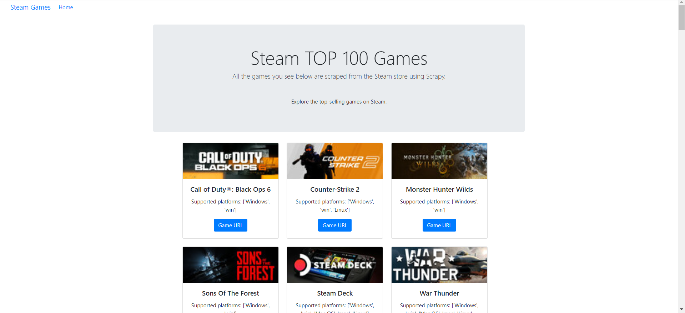

# Steam Top 100 Sellers Scraper

This project scrapes the top 100 best-selling games from the Steam store using Scrapy and displays the data through a Flask web application. The scraper extracts essential game details, including names, release dates, prices, platforms, and ratings. Data is stored and passed to Flask in real time using `scrapy-rt`, enabling dynamic updates and display within the Flask web app.



## Table of Contents

- [How to Install and Run the Project](#how-to-install-and-run-the-project)
- [Project Structure](#project-structure)
- [Usage](#usage)
- [Configuration](#configuration)
- [Credits](#credits)
- [Acknowledgments](#acknowledgments)

## How to Install and Run the Project

To get started with this project locally, follow these steps to set up the environment and run the scraper and web application.

### Prerequisites

- Python 3.8+
- Scrapy
- Flask

### Setup

1. **Clone the Repository**  
   Clone this repository to your local machine using:
   ```bash
   git clone https://github.com/your-username/your-repository.git
Navigate to the Project Directory
Change into the project directory:

bash
Copy code
cd your-repository
Install Dependencies
Install the required packages from requirements.txt:

bash
Copy code
pip install -r requirements.txt
Start the Flask Server
Launch the Flask application to view the data:

bash
Copy code
python app.py
Run the Scrapy Crawler
In another terminal window, run the Scrapy crawler to start scraping data:

bash
Copy code
scrapy crawl steam_spider
The data collected by Scrapy is stored and passed to Flask in real time using scrapy-rt, allowing you to view the latest scraped information on the Flask web app.

Project Structure
items.py - Defines the data structure for the scraped items, such as game_name, platform, and discounted_rate.
middlewares.py - Configures the Scrapy middleware for spider and downloader operations.
pipelines.py - Processes and cleans up the items before storing them.
settings.py - Contains the Scrapy project settings, including configurations for caching and throttling.
Usage
Open the Flask app on your local server to view the top 100 games.
Run the scraper periodically or as needed to refresh the data.
Configuration
You can adjust the scraping settings in settings.py, such as download delay, caching options, and the number of items scraped (limited to 100 in this setup).

Credits
[Your Name] - GitHub | LinkedIn
Contributors: List other contributors or collaborators here.
If you followed any tutorials or referenced materials to build this project, please link to them here as well.

Acknowledgments
Scrapy Documentation: https://docs.scrapy.org/en/latest/
Flask Documentation: https://flask.palletsprojects.com/en/latest/
Scrapy-RT Documentation: scrapy-rt
